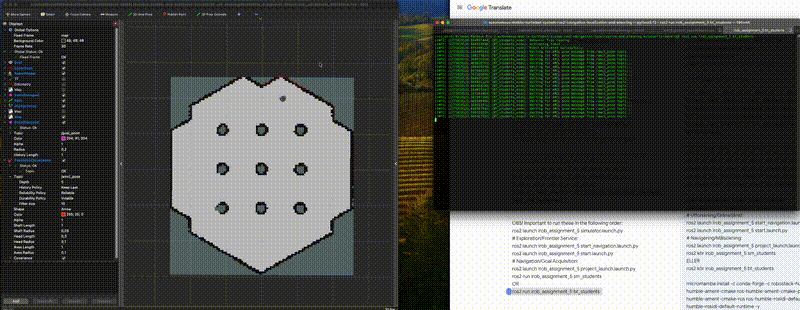

# DD2410 HT25 – Assignment 5: Mobile Robot Project (ROS2, State Machines, Behavior Trees)

This repository contains my solution for **Assignment 5** of the DD2410 (Artificial Intelligence for Robotics) course at KTH.

🔗 Original assignment repository with more description:  
https://github.com/paragkhanna1/KTH_DD2410_Assign5_2025/

I originally completed DD2410 in **HT23** which teached ROS1. This assignment is from a newer iteration of the course (HT25) which teaches ROS2, and which I chose to complete independently to further challenge myself. Unlike the standard course format where this project is done **in pairs**, I completed this assignment **entirely on my own**.

## Demo



---

## 📌 Assignment Overview

This project builds upon Assignment 1 to create an **autonomous Turtlebot** capable of navigating in a simulated environment using:

- State Machines (SM)
- Behavior Trees (BT)
- ROS2 services, topics, and actions

The robot operates in a simulated environment (Gazebo + RViz) and must complete increasingly complex missions involving:

- Activation
- Goal acquisition
- Navigation
- Obstacle avoidance
- Localization
- Exploration

---

## 🧠 Project Concept

In this assignment, I implemented a **mission planner node** responsible for high-level robot behavior.

The system integrates multiple pre-built modules (navigation, sensing, planning), and the goal is to orchestrate them properly.

> “Most of these packages come with very little documentation… you will have to do some digging.”

---

## 📁 Files Implemented

- `sm_students.py` → Contains State Machine implementation
- `bt_students.py` → Contains Behavior Tree implementation
- `project_launch.launch.py` → Contains Launch configuration

---

## 🧪 Tasks & Implementation

---

### 🟢 Task E: Activate → Get Goals → Reach Goals (using State Machine)

#### Description

- No sensor usage required
- Hardcoded movements allowed

but we still used exploration and Nav2 for navigation

#### State Machine Logic

1. Activate robot
2. Request goal
3. Check:
   - Goal invalid / in obstacle?
4. Navigate to goal
5. Precision align to goal
6. Check:
   - Goal reached?
7. Repeat until no goals remain
8. Deactivate robot

#### Evaluation Considerations

- What happens if robot is displaced?
- What if new goals arrive mid-execution?

### 🔴 Task A: Full Autonomy (Navigation + Localization)

We jumped immediately to Task A instead of Task C.

#### Requirements

- Unknown initial pose
- Use navigation stack (Nav2)
- Use AMCL (particle filter)

#### Behavior Tree Logic

1.  Activate robot
2.  Explore environment
3.  Localize robot (AMCL)
4.  Get goal
5.  Validate goal
    - Reject if inside obstacle
6.  Navigate to goal
7.  Precision align to goal
8.  Verify goal reached
9.  Repeat until no new goals
10. Deactivate robot

---

### ⚠️ Special Constraints

- Must handle **robot kidnapping**
- Cannot use `/gazebo/model_states`
- Must rely on:
  - Sensor data
  - Particle distribution (AMCL)

---

## 🧰 Running the Project

---

### 🔧 Initial Setup

Run in **two terminals**:

```bash
export TURTLEBOT3_MODEL=burger
```

---

### 🏗️ Build

```bash
colcon build --packages-select irob_interfaces \
  --cmake-args \
  -DPython_EXECUTABLE=$CONDA_PREFIX/bin/python \
  -DPython3_EXECUTABLE=$CONDA_PREFIX/bin/python \
  -DPYTHON_EXECUTABLE=$CONDA_PREFIX/bin/python \
  -DPython_FIND_STRATEGY=LOCATION \
  -DPython3_FIND_STRATEGY=LOCATION && \
colcon build --packages-select irob_assignment_5
```

---

### 🔄 Source Environment

```bash
source install/setup.bash
```

---

### 🌍 Launch Simulation

```bash
ros2 launch irob_assignment_5 simulator.launch.py
```

Wait until Gazebo and RViz are fully loaded before proceeding.

---

## 🚀 Running Task A (Behavior Tree)

---

### Step 1: Start Navigation & Exploration

```bash
ros2 launch irob_assignment_5 start_navigation.launch.py
ros2 launch irob_assignment_5 start.launch.py
```

---

### Step 2: After Exploration Finishes run Behavior Tree

Cancel the above commands, then run:

```bash
ros2 launch irob_assignment_5 project_launch.launch.py
ros2 run irob_assignment_5 bt_students
```

---

### Step 3: Initialize Localization

In RViz:

➡️ Click **"2D Pose Estimate"**  
➡️ Set initial pose

This enables AMCL to start publishing localization data.

---

## ⚙️ Running Task E (State Machine)

---

### Steps

Run:

```bash
export TURTLEBOT3_MODEL=burger
colcon build ...
source install/setup.bash
ros2 launch irob_assignment_5 simulator.launch.py
```

Then:

### Step 1: Start Navigation & Exploration

```bash
ros2 launch irob_assignment_5 start_navigation.launch.py
ros2 launch irob_assignment_5 start.launch.py
```

---

### Step 2: After Exploration Finishes run State Machine

Cancel the above commands, then run:

```bash
ros2 launch irob_assignment_5 project_launch.launch.py
ros2 run irob_assignment_5 sm_students
```

---

## 🔍 Debugging & Notes

- Use ROS tools:
  - `ros2 topic`
  - `ros2 service`
  - `ros2 msg`
  - `ros2 run tf view_frames`

- TF visualization helps when robot doesn't appear in RViz

---

## ⚠️ Known Issues (Out of Scope)

- Navigation stack may:
  - Get stuck in loops
  - Spin indefinitely near goals

- Minor collisions with obstacles may occur

💡 Workarounds:

- Pause simulation and manually adjust robot
- Retry simulation

---

## 💡 Important Insights

- AMCL requires robot movement (e.g., spinning) to converge
- Particle distribution indicates localization certainty
- Avoid blocking waits → prefer asynchronous handling
- Behavior Trees provide better reactivity than State Machines

---

## 🧪 Testing Tips

- Move robot manually during simulation (simulate kidnapping)
- Change goal parameters
- Move obstacles

---

## 🎯 Final Goal

A fully autonomous robot that:

- Activates itself
- Explores environment
- Localizes accurately
- Accepts dynamic goals
- Navigates safely
- Handles unexpected changes

---
